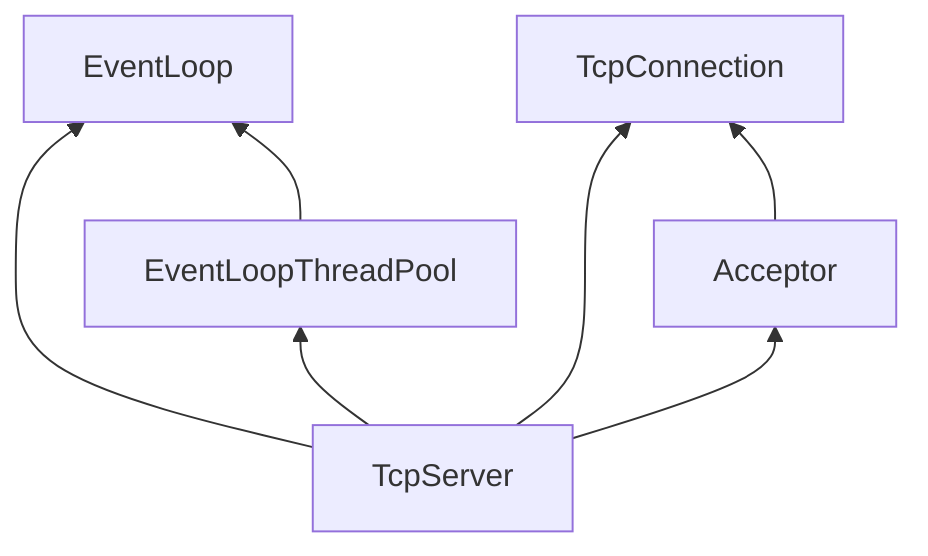
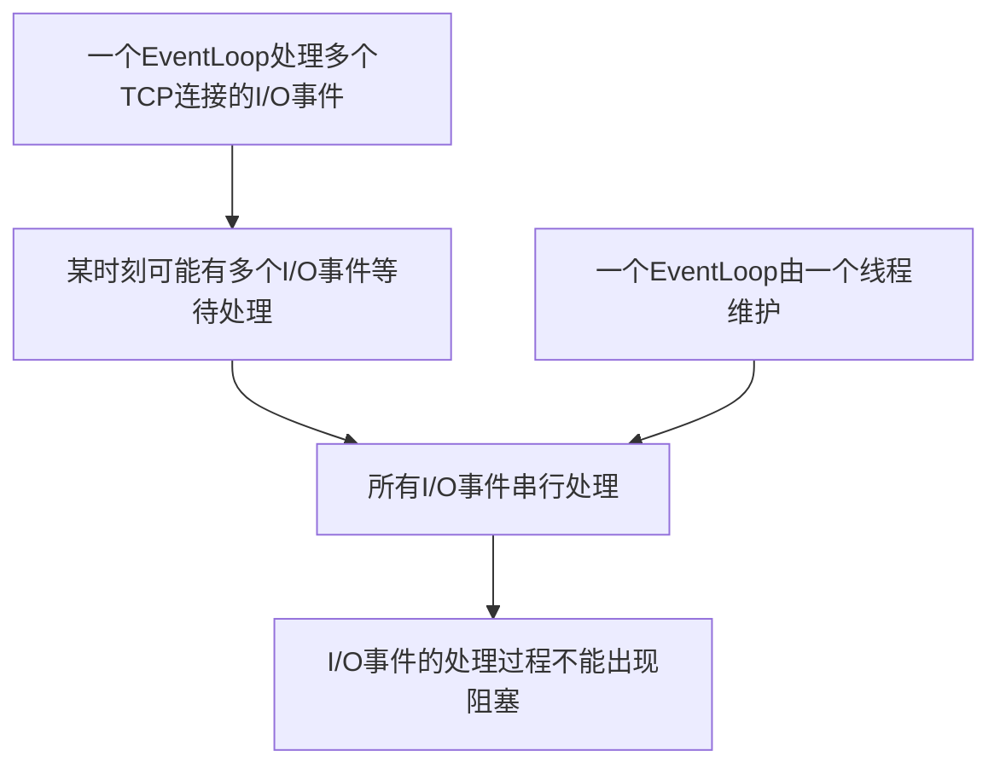
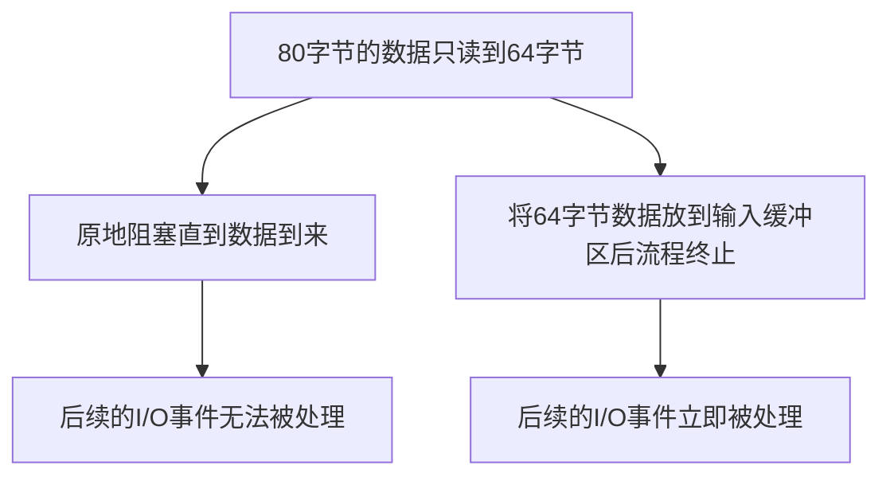
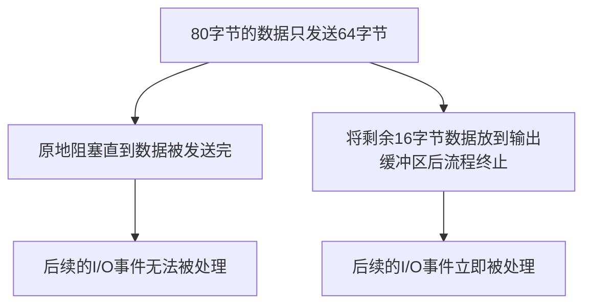
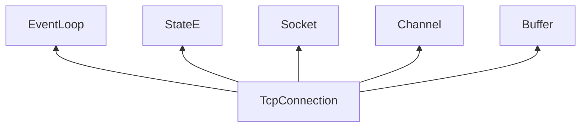
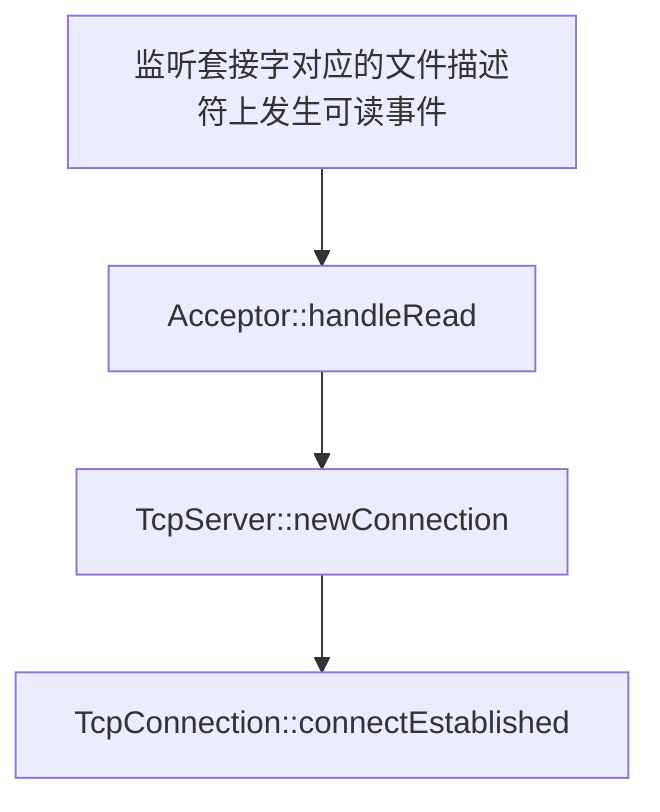

#  TcpServer 关键数据成员

在muduo中，`TcpServer`的实现在`muduo/net/TcpServer.{h/cpp}`文件中，其中`TcpServer.h`包含了`TcpServer`的数据成员定义和其接口的声明；`TcpServer.cpp`包含了`TcpServer`接口的具体实现。

`TcpServer` 由几个关键数据成员所组成，它的类型定义如下：

```cpp
// muduo/net/TcpServer.c
class TcpServer : noncopyable {
public:
	...
private:
	...
	EventLoop* loop_;
	std::shared_ptr<EventLoopThreadPool> threadPool_;
	const std::string ipPort_;
	const std::string name_;
	std::unique_ptr<Acceptor> acceptor_;
	std::map<std::string, std::shared_ptr<TcpConnection>> connections_;
	...
};
```

其中成员`ipPort_` 表示TCP服务器所监听的IP地址和端口号，成员`name_` 表示TCP服务器的名称，一般用业务的名称所指代，如代理服务器的`name_` 即为`proxyServer`等。

成员`loop_` 是`TcpServer` 的主事件循环，此外，`threadPool_` 是`TcpServer` 的线程池成员，池中每个线程负责维护独立的事件循环；它们一起负责处理服务器上的I/O事件和定时事件等。

成员`acceptor_` 主要负责响应客户端的TCP连接请求，并建立新的连接，建立的新连接存放在成员`connections_`中，它是一个字符串与TCP连接之间的映射。

成员之间的类型依赖图如下：



接下来我们详细分析`TcpServer`的关键数据成员，上文我们已经详细介绍了`EventLoop`类型的实现，故在本文中我们不再进行介绍。`Acceptor` 结构的定义中同样包含 `TcpConnection` 类型的成员，因此为了降低理解的难度，我们首先分析`TcpConnection` 的实现。

## TcpConnection 关键数据成员

`TcpConnection`是muduo所封装的TCP连接类型，它的实现在`muduo/net/TcpConnection.{h/cpp}`文件中，其中`TcpConnection.h`包含了`TcpConnection`的数据成员定义和其接口的声明；`TcpConnection.cpp`包含了`TcpConnection`接口的具体实现。

我们首先来看`TcpConnection` 类型的定义：

```cpp
// muduo/net/TcpConnection.h
class TcpConnection : noncopyable, public std::enable_shared_from_this<TcpConnection> {
public:
	...
private:
	...
	EventLoop* loop_;
	StateE state_;
	std::unique_ptr<Socket> socket_;
	std::unique_ptr<Channel> channel_;
	Buffer inputBuffer_;
	Buffer outputBuffer_;
	...
};
```

作为一个TCP连接，I/O事件如何处理是其必须要思考的问题之一，muduo中选择使用事件循环来处理连接上的I/O事件，因此成员`loop_` 表示处理该连接I/O事件的事件循环。

我们知道，从服务器的角度出发，一条TCP连接对应了内核套接字对象，每个内核套接字在用户态都对应了一个文件描述符。成员`socket_` 表示本TCP连接所持有的套接字，它的类型是`Socket`，这是一种muduo封装的套接字类型，我们将在后面介绍该类型。成员`channel_` 表示本TCP连接对应的文件描述符以及其一系列事件的封装。


`TcpConnection` 的两个成员是`inputBuffer_` 和 `outputBuffer_`，它们是TCP连接在用户态的输入缓冲区和输出缓冲区。到这里我们需要思考一个问题，既然内核套接字中也维护了输入和输出缓冲区，为什么我们还要在用户态再额外维护一个输入缓冲区和输出缓冲区呢？

为了回答这个问题，让我们先将目光放到事件循环`EventLoop`上。我们知道，muduo采用的编程模型是每个线程单独维护一个`EventLoop`，一个`EventLoop` 可能会处理多个TCP连接的I/O事件。当某一时刻有多个TCP连接的I/O事件发生时，由于只有一个线程，因此这些I/O事件的处理是串行的。由于I/O事件是串行处理的，因此我们希望每个事件的处理过程中不要出现阻塞，否则一个事件阻塞住后将影响后续所有事件的处理。


弄清楚这段逻辑关系后，我们再来分析为什么需要用户态的输入缓冲区。我们知道TCP协议是面向字节流的，因此每次用户态从内核套接字中读取到的数据可能不是完整的。举个例子，假设一个客户端的请求信息为80字节，我们此次从内核套接字中读取了64字节的数据，那么为了处理客户端的请求信息，我们需要等待剩余的16字节数据。此时我们有两个选择，第一是原地阻塞等待，直到后续的16字节到来，此时后面的I/O事件无法被处理；第二是将读取到的64字节放到输入缓冲区中，并结束处理流程，此时后面的I/O事件可以立即被处理。



按照这个思路，我们再来分析为什么需要用户态的输出缓冲区。举个例子，假设收到请求后，服务端生成了一个响应，响应的信息为80字节；我们此次向内核套接字写入了64字节的数据，那么为了向客户端发送完整的响应信息，我们还需要发送剩余的16字节数据。此时我们有两个选择，第一是原地阻塞等待，直到能够向内核套接字写入剩余的16字节，此时后面的I/O事件无法被处理；第二是将剩余的16字节放到输出缓冲区中，并结束处理流程，此时后面的I/O事件可以立即被处理。



介绍完`TcpConnection` 的最后两个成员，我们来看看它的类型依赖关系：



为了更好地理解`TcpConnection` 相关接口的实现，我们首先先来看看`Socket` 和 `Buffer` 的实现。

## Socket 的系统调用接口

由于`Socket`类型的数据成员只有内核套接字对象所对应的文件描述符，因此我们不再介绍`Socket` 类型的数据成员，直接来看接口。

`Socket` 类型提供的第一类接口是系统调用的封装，声明如下：

```cpp
// net/muduo/Socket.h
class Socket : noncopyable {
public:
	...
	void bindAddress(const InetAddress &localAddr);
	void listen();
	int accept(InetAddress *peeraddr);
	void shutdownWrite();
	...
};
```

其中`bindAddress` 是系统调用`bind`的封装，`listen` 是系统调用`listen`的封装，`accept` 是系统调用`accept`的封装，`shutdownWrite` 是系统调用`shutdown`的封装，默认关闭写方向的连接。

接口中出现的类型`InetAddress` 是标准库类型`struct sockaddr_in` 类型的封装，在这里不再仔细介绍，我们可以把它看作是IP地址和端口号的组合。

## Socket 的套接字选项接口

`Socket` 类型提供的第二类接口是常用套接字选项的封装，声明如下：

```cpp
// net/muduo/Socket.h
class Socket {
public:
	...
	void setTcpNoDelay(bool on);
	void setReuseAddr(bool on);
	void setReusePort(bool on);
	void setKeepAlive(bool on);
	...
};
```

`Socket` 类型对内核套接字使用最多的四个选项进行了封装，它们分别是：1. `TCP_NODELAY`，表示关闭Nagle算法；2. `SO_REUSEADDR`，表示可以重复绑定使用位于`TIME_WAIT` 的内核套接字；3. `SO_REUSEPORT`，表示多个内核套接字可以绑定到同一个`InetAddress` 上；4. `TCP_KEEPALIVE`，表示开启内核的TCP连接保活机制。

## Buffer 关键数据成员

介绍完`Socket` 类型的实现后，我们接着来看muduo是如何实现用户态缓冲区`Buffer` 的。我们首先来看它的定义：

```cpp
// muduo/net/Buffer.h
class Buffer : copyable {
public:
	...
	size_t prependableBytes() const { return readerIndex_; }
	size_t readableBytes() const { return writerIndex_ - readerIndex_; }
	size_t writableBytes() const { return buffer_.size() - writerIndex_;}
private:
	...
	std::vector<char> buffer_;
	size_t readIndex_;
	size_t writerIndex_;
};
```

成员`buffer_` 的类型是`vector<char>`，用于实际存储缓冲的数据。成员`readIndex_` 是一个指针，表示读者下一次从缓冲区中读取数据时的起始位置。成员`writerIndex_` 也是一个指针，表示写者下一次向缓冲区中写入数据时的起始位置。通过这两个指针，我们可以将缓冲区划分为三个区域：
1. 可写入区域：`[start, readerIndex_)`，接口`prependableBytes()` 返回的就是该区域的大小。
2. 可读区域：`[readerIndex_, writerIndex_)`，接口`readableBytes()` 返回的就是该区域的大小。
3. 可写入区域：`[writerIndex_, end)`，接口`writableBytes()` 返回的就是该区域的大小。

我们将在介绍`Buffer` 写入数据接口的时候再来介绍这两个可写入区域的区别。

## 从Buffer 中读取数据的接口

`Buffer` 一共为用户提供了三类读取数据的接口，分别是`retrieve/peek/read`，接下来我们来看它们的实现：

```cpp
// muduo/net/Buffer.h
class Buffer {
public:
	void retrieve(size_t len) {
		if (len < readableBytes()) {
			readerIndex_ += len;
		} else {
			retrieveAll();
		}
	}

	void retrieveIntXX() {
		retrieve(sizeof(intXX_t));
	}

	intXX_t peekIntXX() const {
		...
		intXX_t beXX = 0;
		::memcpy(&beXX, begin() + readerIndex_, sizeof beXX);
		return networkToHostXX(beXX);
	}

	intXX_t readIntXX() const {
		intXX_t result = peekIntXX();
		retrieveXX();
		return result;
	}
	...
};
```

从接口的实现中我们可以发现，`retrieveIntXX` 接口所执行的操作是移动读者指针，即`readerIndex_` 成员，比如当我们调用`retrieveInt64()`时，实际上是将读者指针向后移动了八个字节。

`peekIntXX` 接口所执行的操作是从可读区域中拷贝数据并返回，比如当我们调用`peekInt64()`时，实际上是将可读区域中前八个字节拷贝到变量中并返回。

`readIntXX` 接口是`peekIntXX` 和 `retrieveIntXX` 接口的组合，它先调用`peekIntXX` 接口从缓冲区中拷贝数据，后调用`retrieveIntXX` 接口移动读者指针。

## 向Buffer 中写入数据的接口

`Buffer` 一共为用户提供了两类写入数据的接口，分别是`prepend/append`，接下来我们来看它们的实现：

```cpp
// muduo/net/Buffer.h
class Buffer {
public:
	void append(const char* data, size_t len) {
		...
		std::copy(data, data + len, start() + writerIndex_);
		...
		writerIndex_ += len;
	}
	
	void prepend(const char* data, size_t len) { 
		...
		readerIndex_ -= len;
		std::copy(data, data + len, begin() + readerIndex_);
	}
};
```

从接口的实现中我们可以发现，`append` 接口所执行的操作是先将数据拷贝到缓冲区中，再向右移动写者指针，即将数据拷贝到`[writerIndex_, writerIndex + len)` 这段区域中。而`prepend` 接口所执行的操作是先向左移动读者指针，再将数据拷贝到缓冲区中，即将数据拷贝到`[readerIndex_ - len, readerIndex_)` 这段区域中。

## Buffer 空间管理

前文提到，`Buffer` 中负责存储数据的是成员`buffer_`，它的类型是`std::vector<char>`，这说明它的存储空间不是一成不变的，而是随着数据量的大小动态变化的，因此，本节我们就来看看它的空间是如何变化的。

```cpp
// muduo/net/Buffer.h
class Buffer {
public:
	void append(const char *data, size_t len) {
		ensureWritableBytes(len);
		...
	}
	
	void ensureWritableBytes(size_t len) {
		if (writableBytes() < len) {
			makeSpace(len);
		}
		...
	}
};

```

回顾`append` 接口的实现，我们可以发现，在向缓冲区中添加数据之前，首先得保证缓冲区中有足够的空间；如果没有足够的空间，我们还需要对缓冲区进行调整以腾出空间。具体的空间调整操作由`makeSpace` 函数完成，它的实现如下：

```cpp
// muduo/net/Buffer.h
class Buffer {
private:
	void makeSpace(size_t len) {
		if (writableBytes() + prependableBytes() < len ...) {
			buffer_.resize(writerIndex_ + len);
		} else {
			size_t readable = readableBytes();
			std::copy(begin() + readerIndex_, begin() + writerIndex_, begin());
			readerIndex_ = begin();
			writerIndex_ = readerIndex_ + readable;
		}
	}	
};
```

`makeSpace` 函数首先判断缓冲区内部的剩余空间是否可以容纳新插入的数据，避免内部空间碎片造成不必要的空间分配。当剩余空间充足时，它会将`[readerIndex_, writeIndex_)` 之间的数据移动到`start`处；当剩余空间确实不足时，会调用`vector` 的`resize` 方法，为成员`buffer_` 分配更多的内存空间。

当我们认为缓冲区的空闲空间太大，占用过多内存空间时，我们也可以调用`shrink` 接口收缩缓冲区的空闲空间，具体实现如下：

```cpp
// muduo/net/Buffer.h

class Buffer {
public:
	...
	void shrink(size_t reserve) {
		Buffer other;
		other.ensureWritableBytes(readableBytes() + reserve);
		other.append(toStringPiece());
		swap(other);
	}
};
```

可以发现，参数`reserve` 就是我们想保留的空闲空间字节数，`shrink` 函数首先在栈上创建一个临时`Buffer` 对象，大小为未读取的数据大小加上想保留的空闲空间大小，并将当前缓冲区中所有未读取的数据拷贝到临时对象中，最后通过`swap` 函数与临时对象交换`vector` 结构。原先的缓冲区内存随着临时`Buffer` 对象的销毁而一起被回收。

介绍完用户缓冲区`Buffer` 的实现后，我们将目光放回到`TcpConnection` 上，分析其关键接口的具体实现。

## TcpConnection 读/写数据接口

作为系统与外部通信的媒介，`TcpConnection` 最重要的功能便是从外界读取数据/向外界发送数据，因此本节我们将关注`TcpConnection` 的读/写数据接口。我们首先来看读取数据接口的实现：

```cpp
// muduo/net/TcpConnection.h
class TcpConnection : noncopyable, public std::enable_shared_from_this<TcpConnection> {
public:
	void startRead();
private:
	void startInLoop();
	void handleRead(Timestamp receiveTime);
	typedef std::function<void (const TcpConnectionPtr& Buffer*, Timestamp)> MessageCallback;
	MessageCallback messageCallback_;
};

// muduo/net/TcpConnection.cc
void TcpConnection::startRead() {
	loop_->runInLoop(std::bind(&TcpConnection::startReadInLoop, this));
}

void TcpConnection::startReadInLoop() {
	...
	if (!reading_ || channel_->isReading()) {
		channel_->enableReading();
		reading_ = true;
	}
}

void TcpConnection::handleRead(Timestamp receiveTime) {
	...
	int savedErrno = 0;
	ssize_t n = inputBuffer_.readFd(channel_->fd(), &savedErrno);
	if (n > 0) {
		messageCallback_(shared_from_this(), &inputBuffer_, receiveTime);
	} 
	...
}
```

`TcpConnection` 向外部提供了`startRead` 接口，接口内部调用了`channel_` 成员的`enableReading` 接口，表示希望操作系统在观察到该TCP连接对应的文件描述符上发生了可读事件时，能够通知用户程序。

至于可读事件的处理，则实现在`TcpConnection` 内部的`handleRead` 函数中。函数首先通过文件描述符，从内核套接字中读取数据，并保存到连接的用户态缓冲区中。随后函数通过调用绑定的回调函数成员`messageCallback_`，执行后续的业务逻辑。`messageCallback_` 成员的类型是`std::function<void (const shared_ptr<TcpConnection>&, Buffer*, Timestamp)>`， 表示该回调函数接收一个指向缓冲区的指针参数`Buffer*`，函数通过该指针存储连接上收到的数据。参数`Timestamp` 表示数据何时被收到。

我们再来看发送数据接口的实现：

```cpp
// muduo/net/TcpConnection.h
class TcpConnection : noncopyable, public std::enable_shared_from_this<TcpConnection> {
public:
	void send(const void* message, int len);
	void send(const StringPiece& message);
	void send(Buffer* message);
private:
	void sendInLoop(const void* message, size_t len);
	void handleWrite();
};
```

发送数据部分实现起来比读取数据部分逻辑要复杂一些，我们先从接口开始分析，`TcpConnection` 有三个发送数据的接口，分别是1. `send(const void* message, int len)`，该接口接收待发送数据的起始地址和待发送数据的长度作为参数；2. `send(const StringPiece& message)`，该接口接收一个类型为`StringArgs` 的对象作为参数，而实际上`StringArgs` 是数据起始地址和数据长度的封装，因此在这里不再介绍；3. `send(Buffer*)`，该接口接收一个`Buffer`类型的缓冲区作为参数，其中可读区域就是用户待发送的数据。这三个接口最终都会调用`sendInLoop(const void* data, size_t len)` 函数来在事件循环`EventLoop` 中发送数据。

接下来我们来看看`sendInLoop(const void* data, size_t len)` 函数的实现：

```cpp
// muduo/net/TcpConnection.cc
void TcpConnection::sendInLoop(const void* data, size_t len) {
	...
	ssize_t nwrote = 0;
	size_t remaining = len;
	...
	if (!channel_->isWriting() && outputBuffer_.readableBytes() == 0) {
		nwrote = sockets::write(channel_->fd(), data, len);
		if (nwrote >= 0) {
			remaining = len - nwrote;
			if (remaining == 0 && writeCompleteCallback_) {
				loop_->queueInLoop(std::bind(writeCompleteCallback_, shared_from_this()));
			}
			...
		}
		...
	}
	...
	if (remaining > 0) {
		...
		outputBuffer_.append(static_cast<const char*>(data) + nwrote, remaining);
		if (!channel_->isWriting()) {
			channel_->enableWriting();
		}
	}
}
```

函数首先通过`channel_.isWriting()` 判断先前是否让操作系统通知该连接文件描述符上的可写事件，如果是，则说明程序上次调用接口时没有将待发送数据完全发送，所以才关注了该文件描述符上的可写事件。

当用户程序没有关注文件描述符上的可写事件，且发送缓冲区中也没有数据时，函数可以直接调用`write`系统调用来发送数据。函数使用`remaining` 变量记录未发送的长度，如果`remaining == 0` ，那么本次`write` 系统调用已经发送完所有的数据；当用户程序绑定了`WriteCompleteCallback` 回调函数时，该回调函数将会在此处被执行。

当`remaining > 0` 时，此次`write` 系统调用没有发送完所有待发送的数据，因此需要将剩余的部分保存到输出缓冲区`outputBuffer_` 中，等待下次`write` 系统调用时再写入；用户程序也不知道什么时候可以执行下次系统调用，因此设置`channel_->enableWriting()`，希望操作系统能在连接对应的文件描述符可写事件发生的时候通知用户程序。

至于可写事件的处理，则实现在`TcpConnection` 内部的`handleWrite` 函数中，它的实现如下：

```cpp
// muduo/net/TcpConnection.cc
void TcpConnection::handleWrite() {
	if (channel_->isWriting()) {
		ssize_t n = sockets::write(channel_->fd(), outputBuffer_.peek(), outputBuffer_readableBytes());
		if (n > 0) {
			outputBuffer_.retrieve(n);
			if (outputBuffer_->readableBytes() == 0) {
				channel_->disableWriting();
				if (writeCompleteCallback_) {
					loop_->queueInLoop(std::bind(writeCompleteCallback_, shared_from_this()));
				}
				...
			}
		}
		...
	}
	...
}
```

函数通过调用`write`系统调用尝试发送输出缓冲区中的所有数据，如果全部发送完毕，则设置`channel_->disableWriting()`，表示操作系统不同再通知用户程序该连接文件描述符上的可写事件了，因为已经没有数据需要发送；如果用户设置了连接上的`WriteCompleteCallback` 回调函数，该回调函数将会在此处被执行。

## TcpConnection 状态转换

```cpp
// muduo/net/TcpConnection.h
class TcpConnection {
	...
private:
	enum StateE { kDisconnected, kConnecting, kConnected, kDisconnecting };
};
```

muduo使用枚举类型来表示TCP连接的所有状态，一共有四个值：1. `kDisconnected` 表示TCP连接未建立；2. `kConnecting` 表示TCP连接正在建立中；3. `kConnected` 表示TCP连接已经建立；4. `kDisconnecting` 表示TCP连接正在被断开。成员`state_`表示本TCP连接正处于的状态。

TCP连接的状态转换经历了如下的过程：1. 当`TcpConnection` 的构造函数被调用时，TCP连接处于`kConnecting`状态。2. 当`TcpConnection::Established` 函数被调用时，TCP连接处于`kConnected`状态。3. 当`shutdown`函数或`forceclose` 函数被调用时，用户程序想要主动断开连接，此时TCP连接处于`kDisconnecting`状态。4. 当`connectDestroyed` 函数或`handleClose` 函数被调用时，此时TCP连接已经断开完毕，因此处于`kDisconnected` 状态。


## Acceptor 关键数据成员

介绍完`TcpConnection` 的数据成员和接口实现后，我们接下来来分析`Acceptor` 的实现，看看它是如何获取TCP连接的。我们首先来看它的数据成员：

```cpp
// muduo/net/Acceptor.h
class Acceptor : noncopyable {
public:
	...
private:
	EventLoop* loop_;
	Socket acceptSocket_;
	Channel acceptChannel_;
	NewConnectionCallback newConnectionCallback_;
	...
};
```

其中，成员`acceptSocket_` 表示服务端监听的`Socket` 对象，用于接收来自其它客户端的连接请求。成员`acceptChannel_` 表示`Socket` 对象对应的文件描述符以及其一系列事件的封装。成员`loop_` 表示处理该`Socket` 对象上I/O事件的事件循环。成员`newConnectionCallback_` 是用户程序绑定的回调函数，在获取新TCP连接时被调用。

## Acceptor 的构造函数与listen接口

通过观察`Acceptor` 的构造函数，我们可以发现muduo对服务端监听的`Socket` 对象所做的一系列设置：

```cpp
// muduo/net/Acceptor.cc
Acceptor::Acceptor(EventLoop* loop, const InetAddress& listenAddr, bool reuseport)
: loop_(loop), acceptSocket_(sockets::createNonblockingOrDie(listenAddr.family())), acceptChannel_(loop, acceptSocket_.fd()), ... {
	acceptSocket_.setReuseAddr(true);
	acceptSocket_.setReusePort(reuseport);
	acceptSocket_.bindAddress(listenAddr);
	acceptChannel_.setReadCallback(std::bind(&Acceptor::handleRead, this));
}

void Acceptor::listen() {
	...
	acceptChannel_.enableReading();
	...
}
```

对于`Acceptor` 监听的`Socket` 对象而言，它被默认设置了`SO_REUSEADDR` 属性，即允许重用位于`TIME_WAIT` 状态的内核套接字。用户程序可以选择设置该`Socket` 对象的`SO_REUSEPORT` 属性，即允许多个内核套接字绑定同一个`InetAddress`。

此外，构造函数还为`Socket` 对象对应的文件描述符绑定了可读事件的处理函数`handleRead`，`listen` 接口也设置了`acceptChannel_.enableReading()`，表示当操作系统监听到该文件描述符上的可读事件时会通知用户程序。这是因为在多路复用机制中，当新的TCP连接到达监听套接字的全连接队列时，该套接字对应的文件描述符上会发生可读事件，表示可以通过`accept` 系统调用获取该新到达的TCP连接。

## Acceptor 获取新TCP连接

`Acceptor` 获取新TCP连接的流程实现在`handleRead` 函数中，实现如下：

```cpp
// muduo/net/Acceptor.cc
void Acceptor::handleRead() {
	...
	InetAddress peerAddr;
	int connfd = acceptSocket_.accept(&peerAddr);
	if (connfd >= 0) {
		if (newConnectionCallback_) {
			newConnectionCallback_(connfd, peerAddr);
		}
		...
	}
	...
}
```

函数首先通过调用`accept` 系统调用获取新TCP连接，如果新连接获取成功且用户程序设置了回调函数`NewConnectionCallback`，则该函数在此时被调用。

# TcpServer 的构造函数和newConnection函数

在介绍完`TcpConnection` 和 `Acceptor` 的实现后，我们将目光放回到`TcpServer` 上，分析它是如何处理TCP连接上的各类事件的。我们首先来看`TcpServer` 的构造函数，它的实现如下：

```cpp
// muduo/net/TcpServer.cc
TcpServer::TcpServer(EventLoop* loop, const InetAddress& listenAddr, const string& nameArg, Option option) : 
loop_(loop), 
ipPort(listenAddr.toIpPort()),
name_(nameArg),
acceptor_(new Acceptor(loop, listenAddr, option == kReusePort)),
connectionCallback_(defaultConnectionCallback),
messageCallback_(defaultMessageCallback),
...
{
	acceptor_->setNewConnectionCallback(
		std::bind(&TcpServer::newConnection, this, _1, _2)
	);
}
```

从构造函数中我们首先可以发现，`TcpServer` 的`loop` 成员也是`acceptor_` 的 `loop` 成员，这表示，`TcpServer` 的事件循环也将处理`Acceptor` 上的I/O事件。构造函数还将成员`acceptor_` 的`newConnectionCallback_` 成员设置为`newConnection` 函数，这表示当`Acceptor` 获取到新的TCP连接时，将调用`TcpServer` 的`newConnection` 函数。`newConnection` 函数的定义如下：

```cpp
// muduo/net/TcpServer.h
class TcpServer {
public:
	...
private:
	ConnectionCallback connectionCallback_;
	MessageCallback messageCallback_;
	WriteCompleteCallback writeCompleteCallback_;
	CloseCallback closeCallback_;
};

// muduo/net/TcpServer.cc
void TcpServer::newConnection(int sockfd, const InetAddress& peerAddr) {
	...
	EventLoop *ioLoop = threadPool_->getNextLoop();
	...
	InetAddress localAddr(sockets::getLocalAddr(sockfd));
	TcpConnectionPtr conn(new TcpConnection(ioLoop, ..., sockfd, localAddr, peerAddr));
	connections_[connName] = conn;
	conn->setConnectionCallback(connectionCallback_);
	conn->setMessageCallback(messageCallback_);
	conn->setWriteCompleteCallback(writeCompleteCallback_);
	conn->setCloseCallback(std::bind(&TcpServer::removeConnection, this, _1));
	ioLoop->runInLoop(std::bind(&TcpConnection::connectEstablished, conn));
}
```

`newConnection` 函数实现的流程稍微复杂一些，我们一步步来看。首先，它通过`threadPool_->getNextLoop()` 获取了处理该TCP连接I/O事件的事件循环，用`ioLoop` 表示。`threadPool_` 成员我们将会在后面的`TcpServer` 多线程模式中进行介绍，在这里我们可以认为`ioLoop` 指的就是`TcpServer` 的`loop_` 成员。

随后函数根据内核套接字对应的文件描述符创建了新TCP连接对应的`TcpConnection` 对象，并将该对象存储到了`TcpServer` 的`connections_` 成员中。函数还为该`TcpConnection` 对象设置了四类回调函数成员，分别是：1. `ConnectionCallback`，当新的`TcpConnection`创建时被调用；2. `MessageCallback`，当`TcpConnection` 对象上有数据到来时被调用；3. `WriteCompleteCallback`，当`TcpConnection` 对象上所有响应数据发送完毕时被调用；4. `CloseCallback`，当`TcpConnection` 对象关闭时被调用。

对新创建的`TcpConnection` 对象的操作完毕后，函数让事件循环执行对象的`connectionEstablished` 函数，表示让事件循环开始负责处理该对象上后续发生的I/O事件。

# TCP 连接的获取与关闭

在介绍完`TcpServer`、`TcpConnection`、`Acceptor` 的关键成员和接口实现后，我们来梳理一下一条新的TCP连接是如何在TCP服务器中被获取和被关闭的。我们首先来看新TCP连接被获取的流程。

首先，当新的TCP连接到达内核套接字的全连接队列时，`Acceptor` 监听的套接字对应的文件描述符上发生可读事件，事件循环通过调用`Acceptor::handleRead` 函数处理该事件。`handleRead` 函数首先通过系统调用`accept` 获取新TCP连接对应的文件描述符，随后调用`TcpServer` 绑定的回调函数`TcpServer::newConnection`执行后续流程。在`newConnection` 函数中，新的`TcpConnection` 对象被创建，其一系列回调函数也被设置。最终，事件循环通过调用`TcpConnection` 的`TcpConnection::connectEstablished` 函数，开始负责处理该对象上后续发生的I/O事件。整体过程如图所示：



相较于TCP连接的获取，TCP连接的关闭场景更复杂一些。`TcpConnection` 提供了两种关闭连接的方式，分别是调用`handleClose` 函数和调用`shutdownInLoop` 函数，它们的实现如下：

```cpp
// muduo/net/TcpConnection.cc
void TcpConnection::handleClose() {
	...
	channel_->disableAll();
	closeCallback_();
	...
}

void TcpConnection::shutdownInLoop() {
	...
	if (!channel_->isWriting()) {
		socket_->shutdownWrite();
	}
}
```

其中，`handleClose`函数首先通过`channel_->disableAll()` 让操作系统不再关注该TCP连接对应的文件描述符上发生的所有事件，并调用`TcpServer` 为`TcpConnection` 绑定的`closeCallback_` 回调函数。而`shutdownInLoop` 函数则是调用`shutdown` 系统调用，关闭发送方向上的连接。

至于TCP连接对应的文件描述符的关闭工作，则留给`Socket` 成员的析构函数来完成，这样做的好处是，通过观察`TcpServer` 进程的打开文件，我们可以定位到那些出现泄漏的`TcpConnection` 对象，由于它们没有被析构，所以它们的`Socket`成员也不会析构，`Socket`成员持有的文件描述符也不会被关闭。

```cpp
// muduo/net/Socket.h
Socket::~Socket() {
	sockets::close(sockfd_);
}
```

# TcpServer 多线程模式

介绍`TcpServer` 的多线程模式之前，我们先来看看单线程的`TcpServer` 是如何实现的。我们知道，muduo采用的编程模型是每个线程单独维护一个`EventLoop`，所以单线程的`TcpServer` 只使用了一个事件循环，即它的成员`loop_`，无论是`Acceptor` 上发生的I/O事件，还是后续TCP连接上发生的I/O事件，都是由`TcpServer` 的成员`loop_`负责处理。

既然单线程模式就可以处理所有连接的I/O事件，为什么`TcpServer` 还需要多线程模式呢？这是因为，当连接的I/O事件和`Acceptor`的I/O事件一起处理时，很可能出现海量连接的I/O事件需要处理，`Acceptor` 的I/O事件迟迟得不到处理，从而导致新的TCP连接一直获取不到的情况。因此我们希望`Acceptor` 的I/O事件能够使用单独的事件循环处理，其它连接的I/O事件由多个事件循环共同处理的模式。

介绍完单线程模式后，我们再来看看`TcpServer` 的多线程模式是如何实现的。我们首先查看`TcpServer` 的定义：

```cpp
// muduo/net/TcpServer.h
class TcpServer {
public:
	...
private:
	...
	std::shared_ptr<EventLoopThreadPool> threadPool_;
};
```

可以看到，`threadPool_`成员的类型为`EventLoopThreadPool`，我们接着来看`EventLoopThreadPool` 类型的定义：

```cpp
// muduo/net/EventLoopThreadPool.h
class EventLoopThreadPool : noncopyable {
public:
	EventLoopThreadPool(EventLoop* loop, const string& nameArg);
private:
	EventLoop* baseLoop_;
	std::vector<std::unique_ptr<EventLoopThread>> threads_;
	...
};

// muduo/net/EventLoopThread.h
class EventLoopThread : noncopyable {
...
private:
	EventLoop* loop_;
	Thread thread_;
	...
};

// muduo/net/TcpServer.cc 
TcpServer::TcpServer(EventLoop* loop, const string& nameArg)
: threadPool_(new EventLoopThreadPool(loop, name)),
...
```

可以看到线程池中线程的类型都为`EventLoopThread`，该类型是`EventLoop`类型和`Thread`类型的封装，表示一个线程实体`thread_`以及它所维护的事件循环`loop_`。此外，通过观察`TcpServer` 和`EventLoopThreadPool` 的构造函数可以发现，`EventLoopThreadPool` 将`TcpServer` 的`loop_` 成员作为自己的`baseLoop_`。

既然`TcpServer` 采用线程池`EventLoopThreadPool` 的方式来实现多线程模式，那么多线程模式具体有什么用呢？我们可以结合`TcpServer::newConnection` 和 `EventLoopThreadPool::getNextLoop` 来说明：

```cpp
// muduo/net/TcpServer.cc
void TcpServer::newConnection(int sockfd, const InetAddress& peerAddr) {
	...
	EventLoop *ioLoop = threadPool_->getNextLoop();
	...
	ioLoop->runInLoop(std::bind(&TcpConnection::connectEstablished, conn));
}

// muduo/net/EventLoopThreadPool.cc
EventLoop* EventLoopThreadPool::getNextLoop() {
	...
	EventLoop* loop = baseLoop_;
	if (!loops_.empty()) {
		// round-robin
		loop = loops_[next_];
		++next_;
		if (implicit_cast<size_t>(next_) >= loops_.size()) {
			next_ = 0;
		}
	}
	return loop;
}
```

观察`getNextLoop` 的实现，我们可以发现，为TCP连接选择处理I/O事件的事件循环时，`EventLoopThreadPool` 默认使用了轮询(Round-Robin) 的方式，轮询可以保证每个`EventLoopThread`负责处理的TCP连接数量是平均的。

除了均衡各个`EventLoopThread` 的负载，提升`TcpServer` 的吞吐量以外，多线程模式的另一个优点是可以根据业务需求灵活地调整事件循环的分配方式。例如对于高优先级的业务，我们不希望引入额外的时延，此时我们可以将所有来自高优先级业务的连接单独分配到一个事件循环上，保证当I/O事件发生时能够立即被处理。对于那些优先级不高的业务，我们可以让它们的连接共享一个事件循环，这样做能够节省线程资源，此外额外引入的时延也不会对业务产生严重后果。

# 总结

本文对`TcpServer` 的关键数据成员与接口的实现进行了介绍，现对其进行总结：

1. 成员`loop_` 是`TcpServer` 的主事件循环，此外，`threadPool_` 是`TcpServer` 的线程池成员，池中每个线程负责维护独立的事件循环；它们一起负责处理服务器上的I/O事件和定时事件等。
2. 成员`acceptor_` 主要负责响应客户端的TCP连接请求，并建立新的连接，建立的新连接存放在成员`connections_`中，它是一个字符串与TCP连接之间的映射。
3. muduo采用的编程模型是每个线程单独维护一个`EventLoop`，一个`EventLoop` 可能会处理多个TCP连接的I/O事件。当某一时刻有多个TCP连接的I/O事件发生时，由于只有一个线程，因此这些I/O事件的处理是串行的。
4. 由于I/O事件是串行处理的，因此我们希望每个事件的处理过程中不要出现阻塞，否则一个事件阻塞住后将影响后续所有事件的处理。
5. 为什么需要用户态的输入缓冲区？假设一个客户端的请求信息为80字节，我们此次从内核套接字中读取了64字节的数据，那么为了处理客户端的请求信息，我们需要等待剩余的16字节数据。此时我们有两个选择，第一是原地阻塞等待，直到后续的16字节到来，此时后面的I/O事件无法被处理；第二是将读取到的64字节放到输入缓冲区中，并结束处理流程，此时后面的I/O事件可以立即被处理。
6. 为什么需要用户态的输出缓冲区？假设收到请求后，服务端生成了一个响应，响应的信息为80字节；我们此次向内核套接字写入了64字节的数据，那么为了向客户端发送完整的响应信息，我们还需要发送剩余的16字节数据。此时我们有两个选择，第一是原地阻塞等待，直到能够向内核套接字写入剩余的16字节，此时后面的I/O事件无法被处理；第二是将剩余的16字节放到输出缓冲区中，并结束处理流程，此时后面的I/O事件可以立即被处理。
7. `Socket` 类型提供的第一类接口是系统调用的封装，接口中出现的类型`InetAddress` 是标准库类型`struct sockaddr_in` 类型的封装，我们可以把它看作是IP地址和端口号的组合。
8. `Socket` 类型对内核套接字使用最多的四个选项进行了封装，它们分别是：1. `TCP_NODELAY`，表示关闭Nagle算法；2. `SO_REUSEADDR`，表示可以重复绑定使用位于`TIME_WAIT` 的内核套接字；3. `SO_REUSEPORT`，表示多个内核套接字可以绑定到同一个`InetAddress` 上；4. `TCP_KEEPALIVE`，表示开启内核的TCP连接保活机制。
9. 通过`readIndex_` 和 `writerIndex_` 这两个指针，我们可以将缓冲区划分为三个区域：1. 可写入区域：`[start, readerIndex_)`，接口`prependableBytes()` 返回的就是该区域的大小。2. 可读区域：`[readerIndex_, writerIndex_)`，接口`readableBytes()` 返回的就是该区域的大小。3. 可写入区域：`[writerIndex_, end)`，接口`writableBytes()` 返回的就是该区域的大小。
10. `Buffer` 中负责存储数据的是成员`buffer_`，它的类型是`std::vector<char>`，这说明它的存储空间不是一成不变的，而是随着数据量的大小动态变化的。
11. `makeSpace` 函数首先判断缓冲区内部的剩余空间是否可以容纳新插入的数据，避免内部空间碎片造成不必要的空间分配。当剩余空间确实不足时，会调用`vector` 的`resize` 方法，为成员`buffer_` 分配更多的内存空间。
12. 当我们认为缓冲区的空闲空间太大，占用过多内存空间时，我们也可以调用`shrink` 接口收缩缓冲区的空闲空间。
13. `TcpConnection` 向外部提供了`startRead` 接口，接口内部调用了`channel_` 成员的`enableReading` 接口，表示希望操作系统在观察到该TCP连接对应的文件描述符上发生了可读事件时，能够通知用户程序。
14. `TcpConnection` 有三个发送数据的接口，这三个接口最终都会调用`sendInLoop(const void* data, size_t len)` 函数来在事件循环`EventLoop` 中发送数据。
15. 当`remaining > 0` 时，此次`write` 系统调用没有发送完所有待发送的数据，因此需要将剩余的部分保存到输出缓冲区`outputBuffer_` 中，等待下次`write` 系统调用时再写入。
16. 在多路复用机制中，当新的TCP连接到达监听套接字的全连接队列时，该套接字对应的文件描述符上会发生可读事件，表示可以通过`accept` 系统调用获取该新到达的TCP连接。
17. `TcpServer::newConnection` 函数首先通过`threadPool_->getNextLoop()` 获取了处理该TCP连接I/O事件的事件循环，随后函数根据内核套接字对应的文件描述符创建了新TCP连接对应的`TcpConnection` 对象，并将该对象存储到了`TcpServer` 的`connections_` 成员中。
18. 对新创建的`TcpConnection` 对象的操作完毕后，函数让事件循环执行对象的`connectionEstablished` 函数，表示让事件循环开始负责处理该对象上后续发生的I/O事件。
19. `handleRead` 函数首先通过系统调用`accept` 获取新TCP连接对应的文件描述符，随后调用`TcpServer` 绑定的回调函数`TcpServer::newConnection`执行后续流程。在`newConnection` 函数中，新的`TcpConnection` 对象被创建，其一系列回调函数也被设置。
20. `TcpConnection` 提供了两种关闭连接的方式，分别是调用`handleClose` 函数和调用`shutdownInLoop` 函数。
21. 至于TCP连接对应的文件描述符的关闭工作，则留给`Socket` 成员的析构函数来完成，这样做的好处是，通过观察`TcpServer` 进程的打开文件，我们可以定位到那些出现泄漏的`TcpConnection` 对象，由于它们没有被析构，所以它们的`Socket`成员也不会析构，`Socket`成员持有的文件描述符也不会被关闭。
22. 为什么`TcpServer` 还需要多线程模式呢？这是因为，当连接的I/O事件和`Acceptor`的I/O事件一起处理时，很可能出现海量连接的I/O事件需要处理，`Acceptor` 的I/O事件迟迟得不到处理，从而导致新的TCP连接一直获取不到的情况。
23. 除了均衡各个`EventLoopThread` 的负载，提升`TcpServer` 的吞吐量以外，多线程模式的另一个优点是可以根据业务需求灵活地调整事件循环的分配方式。
24. 对于高优先级的业务，我们不希望引入额外的时延，此时我们可以将所有来自高优先级业务的连接单独分配到一个事件循环上，保证当I/O事件发生时能够立即被处理。
25. 对于那些优先级不高的业务，我们可以让它们的连接共享一个事件循环，这样做能够节省线程资源，此外额外引入的时延也不会对业务产生严重后果。