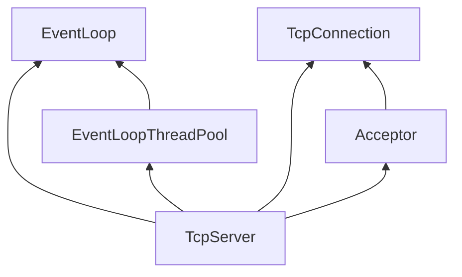
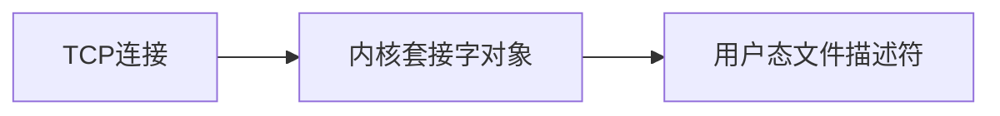
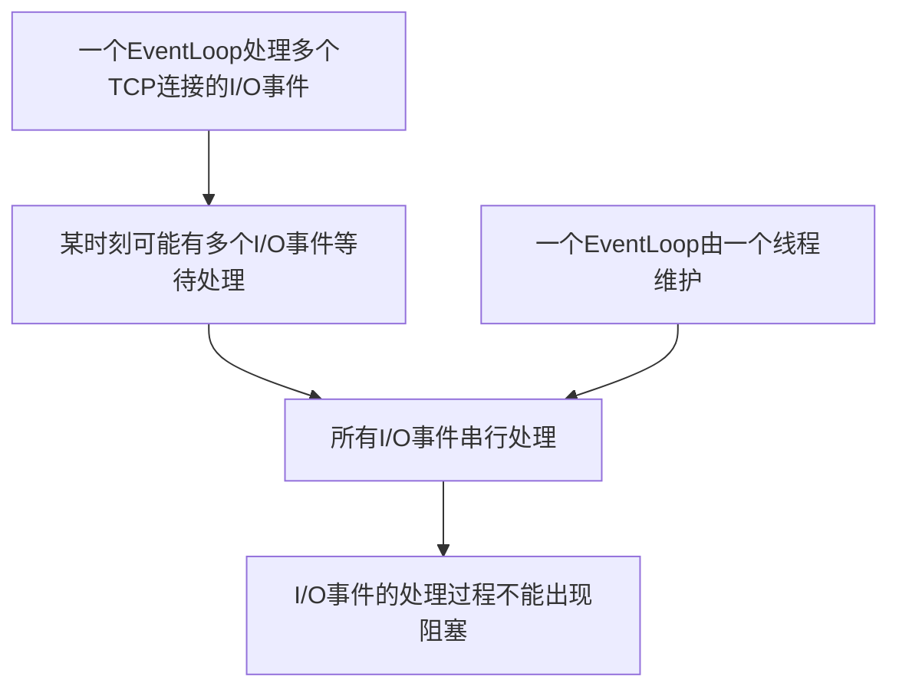
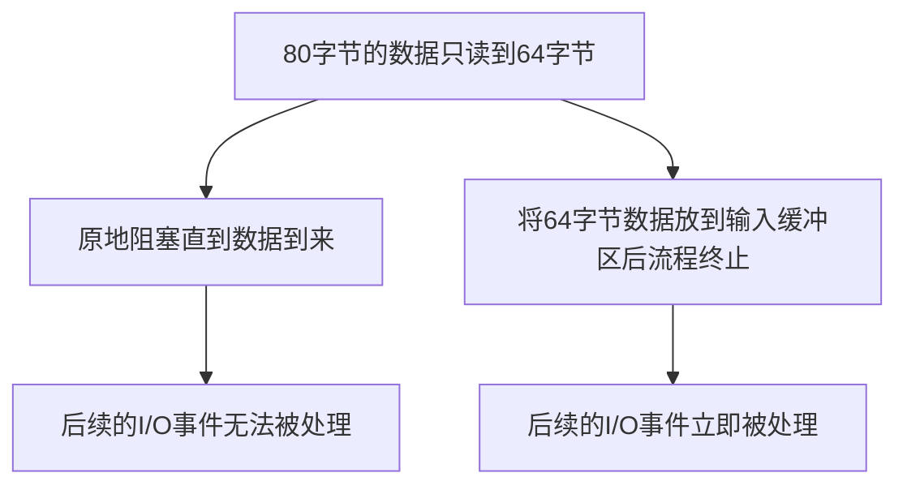
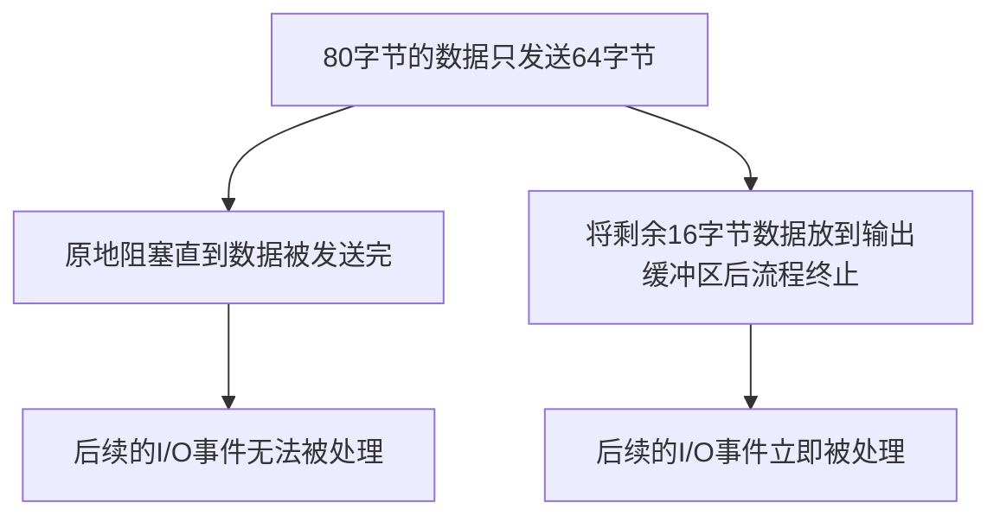
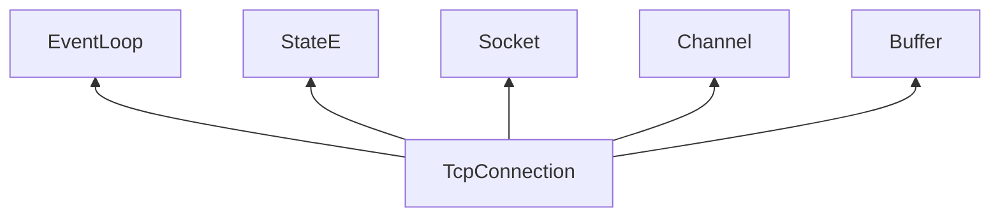

#  关键数据成员

在muduo中，`TcpServer`的实现在`muduo/net/TcpServer.{h/cpp}`文件中，其中`TcpServer.h`包含了`TcpServer`的数据成员定义和其接口的声明；`TcpServer.cpp`包含了`TcpServer`接口的具体实现。

`TcpServer` 由几个关键数据成员所组成，它的类型定义如下：

```cpp
// muduo/net/TcpServer.c
class TcpServer : noncopyable {
public:
	...
private:
	...
	EventLoop* loop_;
	std::shared_ptr<EventLoopThreadPool> threadPool_;
	const std::string ipPort_;
	const std::string name_;
	std::unique_ptr<Acceptor> acceptor_;
	std::map<std::string, std::unique_ptr<TcpConnection>> connections_;
	...
};
```

其中成员`ipPort_` 表示TCP服务器所监听的IP地址和端口号，成员`name_` 表示TCP服务器的名称，一般用业务的名称所指代，如代理服务器的`name_` 即为`proxyServer`等。

成员`loop_` 是`TcpServer` 的主事件循环，此外，`threadPool_` 是`TcpServer` 的线程池成员，池中每个线程负责维护独立的事件循环；它们一起负责处理服务器上的I/O事件和定时事件等。

成员`acceptor_` 主要负责响应客户端的TCP连接请求，并建立新的连接，建立的新连接存放在成员`connections_`中，它是一个字符串与TCP连接之间的映射。

成员之间的类型依赖图如下：



接下来我们详细分析`TcpServer`的关键数据成员，上文我们已经详细介绍了`EventLoop`类型的实现，故在本文中我们不再进行介绍。`Acceptor` 结构的定义中同样包含 `TcpConnection` 类型的成员，因此为了降低理解的难度，我们首先分析`TcpConnection` 的实现。

## TcpConnection 关键数据成员

`TcpConnection`是muduo所封装的TCP连接类型，它的实现在`muduo/net/TcpConnection.{h/cpp}`文件中，其中`TcpConnection.h`包含了`TcpConnection`的数据成员定义和其接口的声明；`TcpConnection.cpp`包含了`TcpConnection`接口的具体实现。

我们首先来看`TcpConnection` 类型的定义：

```cpp
// muduo/net/TcpConnection.h
class TcpConnection {
public:
	...
private:
	...
	enum StateE { kDisconnected, kConnecting, kConnected, kDisconnecting };
	EventLoop* loop_;
	StateE state_;
	std::unique_ptr<Socket> socket_;
	std::unique_ptr<Channel> channel_;
	Buffer inputBuffer_;
	Buffer outputBuffer_;
	...
};
```

作为一个TCP连接，I/O事件如何处理是其必须要思考的问题之一，muduo中选择使用事件循环来处理连接上的I/O事件，因此成员`loop_` 表示处理该连接I/O事件的事件循环。

muduo使用枚举类型来表示TCP连接的所有状态，一共有四个值：1. `kDisconnected` 表示TCP连接未建立；2. `kConnecting` 表示TCP连接正在建立中；3. `kConnected` 表示TCP连接已经建立；4. `kDisconnecting` 表示TCP连接正在被断开。成员`state_`表示本TCP连接正处于的状态。

我们知道，从服务器的角度出发，一条TCP连接对应了内核套接字对象，每个内核套接字在用户态都对应了一个文件描述符。成员`socket_` 表示本TCP连接所持有的套接字，它的类型是`Socket`，这是一种muduo封装的套接字类型，我们将在后面介绍该类型。成员`channel_` 表示本TCP连接对应的文件描述符以及其一系列文件的封装。



`TcpConnection` 的两个成员是`inputBuffer_` 和 `outputBuffer_`，它们是TCP连接在用户态的输入缓冲区和输出缓冲区。到这里我们需要思考一个问题，既然内核套接字中也维护了输入和输出缓冲区，为什么我们还要在用户态再额外维护一个输入缓冲区和输出缓冲区呢？

为了回答这个问题，让我们先将目光放到事件循环`EventLoop`上。我们知道，muduo采用的编程模型是每个线程单独维护一个`EventLoop`，一个`EventLoop` 可能会处理多个TCP连接的I/O事件。当某一时刻有多个TCP连接的I/O事件发生时，由于只有一个线程，因此这些I/O事件的处理是串行的。由于I/O事件是串行处理的，因此我们希望每个事件的处理过程中不要出现阻塞，否则一个事件阻塞住后将影响后续所有事件的处理。


弄清楚这段逻辑关系后，我们再来分析为什么需要用户态的输入缓冲区。我们知道TCP协议是面向字节流的，因此每次用户态从内核套接字中读取到的数据可能不是完整的。举个例子，假设一个客户端的请求信息为80字节，我们此次从内核套接字中读取了64字节的数据，那么为了处理客户端的请求信息，我们需要等待剩余的16字节数据。此时我们有两个选择，第一是原地阻塞等待，直到后续的16字节到来，此时后面的I/O事件无法被处理；第二是将读取到的64字节放到输入缓冲区中，并结束处理流程，此时后面的I/O事件可以立即被处理。



按照这个思路，我们再来分析为什么需要用户态的输出缓冲区。举个例子，假设收到请求后，服务端生成了一个响应，响应的信息为80字节；我们此次向内核套接字写入了64字节的数据，那么为了向客户端发送完整的响应信息，我们还需要发送剩余的16字节数据。此时我们有两个选择，第一是原地阻塞等待，直到能够向内核套接字写入剩余的16字节，此时后面的I/O事件无法被处理；第二是将剩余的16字节放到输出缓冲区中，并结束处理流程，此时后面的I/O事件可以立即被处理。



介绍完`TcpConnection` 的最后两个成员，我们来看看它的类型依赖关系：



为了更好地理解`TcpConnection` 相关接口的实现，我们首先先来看看`Socket` 和 `Buffer` 的实现。

## Socket 的系统调用调用

由于`Socket`类型的数据成员只有内核套接字对象所对应的文件描述符，因此我们不再介绍`Socket` 类型的数据成员，直接来看接口。

`Socket` 类型提供的第一类接口是系统调用的封装，声明如下：

```cpp
// net/muduo/Socket.h
class Socket {
public:
	...
	void bindAddress(const InetAddress &localAddr);
	void listen();
	int accept(InetAddress *peeraddr);
	void shutdownWrite();
	...
};
```

其中`bindAddress` 是系统调用`bind`的封装，`listen` 是系统调用`listen`的封装，`accept` 是系统调用`accept`的封装，`shutdownWrite` 是系统调用`shutdown`的封装，默认关闭写方向的连接。

接口中出现的类型`InetAddress` 是标准库类型`struct sockaddr_in` 类型的封装，在这里不再仔细介绍，我们可以把它看作是IP地址和端口号的组合。

## Socket 的套接字选项接口

`Socket` 类型提供的第二类接口是常用套接字选项的封装，声明如下：

```cpp
// net/muduo/Socket.h
class Socket {
public:
	...
	void setTcpNoDelay(bool on);
	void setReuseAddr(bool on);
	void setReusePort(bool on);
	void setKeepAlive(bool on);
	...
};
```

`Socket` 类型对内核套接字使用最多的四个选项进行了封装，它们分别是：1. `TCP_NODELAY`，表示关闭Nagle算法；2. `SO_REUSEADDR`，表示可以重复绑定使用位于`TIME_WAIT` 的内核套接字；3. `SO_REUSEPORT`，表示多个内核套接字可以绑定到同一个`InetAddress` 上；4. `TCP_KEEPALIVE`，表示开启内核的TCP连接保活机制。