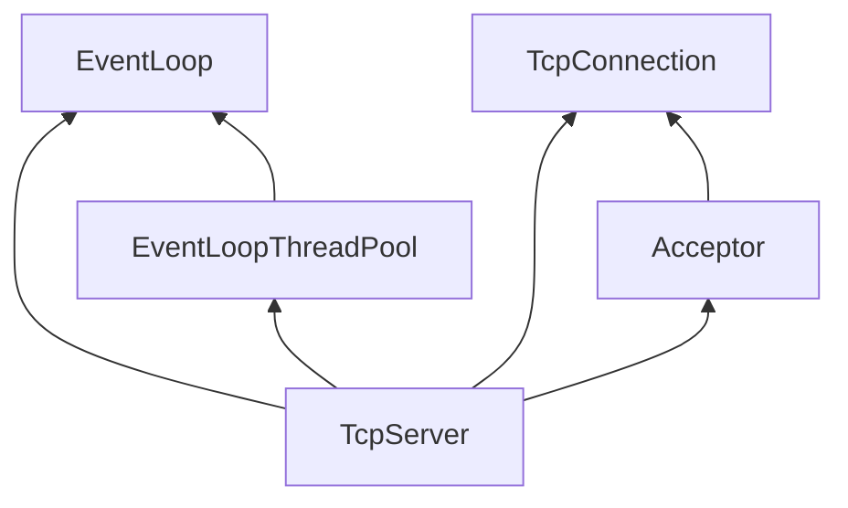
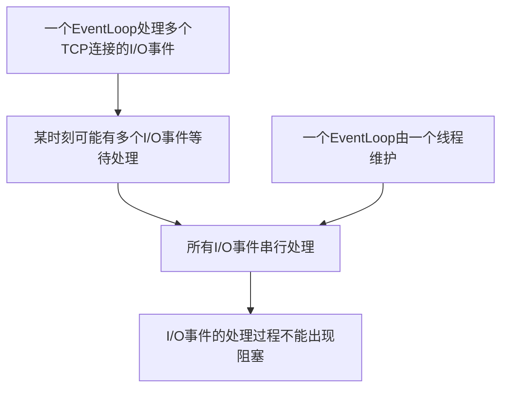
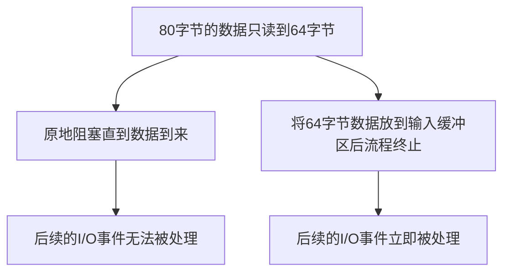
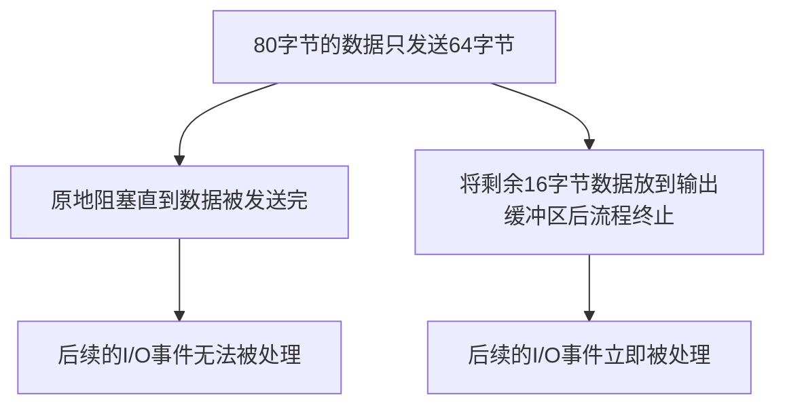
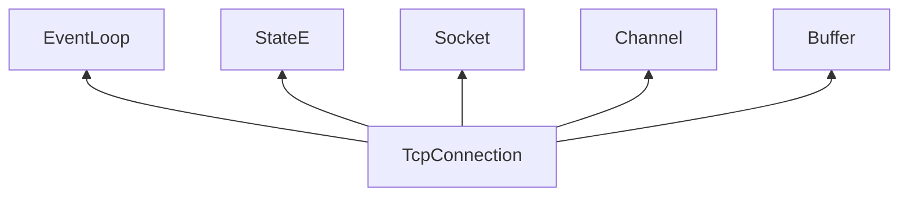

#  关键数据成员

在muduo中，`TcpServer`的实现在`muduo/net/TcpServer.{h/cpp}`文件中，其中`TcpServer.h`包含了`TcpServer`的数据成员定义和其接口的声明；`TcpServer.cpp`包含了`TcpServer`接口的具体实现。

`TcpServer` 由几个关键数据成员所组成，它的类型定义如下：

```cpp
// muduo/net/TcpServer.c
class TcpServer : noncopyable {
public:
	...
private:
	...
	EventLoop* loop_;
	std::shared_ptr<EventLoopThreadPool> threadPool_;
	const std::string ipPort_;
	const std::string name_;
	std::unique_ptr<Acceptor> acceptor_;
	std::map<std::string, std::shared_ptr<TcpConnection>> connections_;
	...
};
```

其中成员`ipPort_` 表示TCP服务器所监听的IP地址和端口号，成员`name_` 表示TCP服务器的名称，一般用业务的名称所指代，如代理服务器的`name_` 即为`proxyServer`等。

成员`loop_` 是`TcpServer` 的主事件循环，此外，`threadPool_` 是`TcpServer` 的线程池成员，池中每个线程负责维护独立的事件循环；它们一起负责处理服务器上的I/O事件和定时事件等。

成员`acceptor_` 主要负责响应客户端的TCP连接请求，并建立新的连接，建立的新连接存放在成员`connections_`中，它是一个字符串与TCP连接之间的映射。

成员之间的类型依赖图如下：



接下来我们详细分析`TcpServer`的关键数据成员，上文我们已经详细介绍了`EventLoop`类型的实现，故在本文中我们不再进行介绍。`Acceptor` 结构的定义中同样包含 `TcpConnection` 类型的成员，因此为了降低理解的难度，我们首先分析`TcpConnection` 的实现。

## TcpConnection 关键数据成员

`TcpConnection`是muduo所封装的TCP连接类型，它的实现在`muduo/net/TcpConnection.{h/cpp}`文件中，其中`TcpConnection.h`包含了`TcpConnection`的数据成员定义和其接口的声明；`TcpConnection.cpp`包含了`TcpConnection`接口的具体实现。

我们首先来看`TcpConnection` 类型的定义：

```cpp
// muduo/net/TcpConnection.h
class TcpConnection : noncopyable, public std::enable_shared_from_this<TcpConnection> {
public:
	...
private:
	...
	enum StateE { kDisconnected, kConnecting, kConnected, kDisconnecting };
	EventLoop* loop_;
	StateE state_;
	std::unique_ptr<Socket> socket_;
	std::unique_ptr<Channel> channel_;
	Buffer inputBuffer_;
	Buffer outputBuffer_;
	...
};
```

作为一个TCP连接，I/O事件如何处理是其必须要思考的问题之一，muduo中选择使用事件循环来处理连接上的I/O事件，因此成员`loop_` 表示处理该连接I/O事件的事件循环。

muduo使用枚举类型来表示TCP连接的所有状态，一共有四个值：1. `kDisconnected` 表示TCP连接未建立；2. `kConnecting` 表示TCP连接正在建立中；3. `kConnected` 表示TCP连接已经建立；4. `kDisconnecting` 表示TCP连接正在被断开。成员`state_`表示本TCP连接正处于的状态。

我们知道，从服务器的角度出发，一条TCP连接对应了内核套接字对象，每个内核套接字在用户态都对应了一个文件描述符。成员`socket_` 表示本TCP连接所持有的套接字，它的类型是`Socket`，这是一种muduo封装的套接字类型，我们将在后面介绍该类型。成员`channel_` 表示本TCP连接对应的文件描述符以及其一系列事件的封装。


`TcpConnection` 的两个成员是`inputBuffer_` 和 `outputBuffer_`，它们是TCP连接在用户态的输入缓冲区和输出缓冲区。到这里我们需要思考一个问题，既然内核套接字中也维护了输入和输出缓冲区，为什么我们还要在用户态再额外维护一个输入缓冲区和输出缓冲区呢？

为了回答这个问题，让我们先将目光放到事件循环`EventLoop`上。我们知道，muduo采用的编程模型是每个线程单独维护一个`EventLoop`，一个`EventLoop` 可能会处理多个TCP连接的I/O事件。当某一时刻有多个TCP连接的I/O事件发生时，由于只有一个线程，因此这些I/O事件的处理是串行的。由于I/O事件是串行处理的，因此我们希望每个事件的处理过程中不要出现阻塞，否则一个事件阻塞住后将影响后续所有事件的处理。


弄清楚这段逻辑关系后，我们再来分析为什么需要用户态的输入缓冲区。我们知道TCP协议是面向字节流的，因此每次用户态从内核套接字中读取到的数据可能不是完整的。举个例子，假设一个客户端的请求信息为80字节，我们此次从内核套接字中读取了64字节的数据，那么为了处理客户端的请求信息，我们需要等待剩余的16字节数据。此时我们有两个选择，第一是原地阻塞等待，直到后续的16字节到来，此时后面的I/O事件无法被处理；第二是将读取到的64字节放到输入缓冲区中，并结束处理流程，此时后面的I/O事件可以立即被处理。



按照这个思路，我们再来分析为什么需要用户态的输出缓冲区。举个例子，假设收到请求后，服务端生成了一个响应，响应的信息为80字节；我们此次向内核套接字写入了64字节的数据，那么为了向客户端发送完整的响应信息，我们还需要发送剩余的16字节数据。此时我们有两个选择，第一是原地阻塞等待，直到能够向内核套接字写入剩余的16字节，此时后面的I/O事件无法被处理；第二是将剩余的16字节放到输出缓冲区中，并结束处理流程，此时后面的I/O事件可以立即被处理。



介绍完`TcpConnection` 的最后两个成员，我们来看看它的类型依赖关系：



为了更好地理解`TcpConnection` 相关接口的实现，我们首先先来看看`Socket` 和 `Buffer` 的实现。

## Socket 的系统调用接口

由于`Socket`类型的数据成员只有内核套接字对象所对应的文件描述符，因此我们不再介绍`Socket` 类型的数据成员，直接来看接口。

`Socket` 类型提供的第一类接口是系统调用的封装，声明如下：

```cpp
// net/muduo/Socket.h
class Socket : noncopyable {
public:
	...
	void bindAddress(const InetAddress &localAddr);
	void listen();
	int accept(InetAddress *peeraddr);
	void shutdownWrite();
	...
};
```

其中`bindAddress` 是系统调用`bind`的封装，`listen` 是系统调用`listen`的封装，`accept` 是系统调用`accept`的封装，`shutdownWrite` 是系统调用`shutdown`的封装，默认关闭写方向的连接。

接口中出现的类型`InetAddress` 是标准库类型`struct sockaddr_in` 类型的封装，在这里不再仔细介绍，我们可以把它看作是IP地址和端口号的组合。

## Socket 的套接字选项接口

`Socket` 类型提供的第二类接口是常用套接字选项的封装，声明如下：

```cpp
// net/muduo/Socket.h
class Socket {
public:
	...
	void setTcpNoDelay(bool on);
	void setReuseAddr(bool on);
	void setReusePort(bool on);
	void setKeepAlive(bool on);
	...
};
```

`Socket` 类型对内核套接字使用最多的四个选项进行了封装，它们分别是：1. `TCP_NODELAY`，表示关闭Nagle算法；2. `SO_REUSEADDR`，表示可以重复绑定使用位于`TIME_WAIT` 的内核套接字；3. `SO_REUSEPORT`，表示多个内核套接字可以绑定到同一个`InetAddress` 上；4. `TCP_KEEPALIVE`，表示开启内核的TCP连接保活机制。

## Buffer 关键数据成员

介绍完`Socket` 类型的实现后，我们接着来看muduo是如何实现用户态缓冲区`Buffer` 的。我们首先来看它的定义：

```cpp
// muduo/net/Buffer.h
class Buffer : copyable {
public:
	...
	size_t prependableBytes() const { return readerIndex_; }
	size_t readableBytes() const { return writerIndex_ - readerIndex_; }
	size_t writableBytes() const { return buffer_.size() - writerIndex_;}
private:
	...
	std::vector<char> buffer_;
	size_t readIndex_;
	size_t writerIndex_;
};
```

成员`buffer_` 的类型是`vector<char>`，用于实际存储缓冲的数据。成员`readIndex_` 是一个指针，表示读者下一次从缓冲区中读取数据时的起始位置。成员`writerIndex_` 也是一个指针，表示写者下一次向缓冲区中写入数据时的起始位置。通过这两个指针，我们可以将缓冲区划分为三个区域：
1. 可写入区域：`[start, readerIndex_)`，接口`prependableBytes()` 返回的就是该区域的大小。
2. 可读区域：`[readerIndex_, writerIndex_)`，接口`readableBytes()` 返回的就是该区域的大小。
3. 可写入区域：`[writerIndex_, end)`，接口`writableBytes()` 返回的就是该区域的大小。

我们将在介绍`Buffer` 写入数据接口的时候再来介绍这两个可写入区域的区别。

## 从Buffer 中读取数据的接口

`Buffer` 一共为用户提供了三类读取数据的接口，分别是`retrieve/peek/read`，接下来我们来看它们的实现：

```cpp
// muduo/net/Buffer.h
class Buffer {
public:
	void retrieve(size_t len) {
		if (len < readableBytes()) {
			readerIndex_ += len;
		} else {
			retrieveAll();
		}
	}

	void retrieveIntXX() {
		retrieve(sizeof(intXX_t));
	}

	intXX_t peekIntXX() const {
		...
		intXX_t beXX = 0;
		::memcpy(&beXX, begin() + readerIndex_, sizeof beXX);
		return networkToHostXX(beXX);
	}

	intXX_t readIntXX() const {
		intXX_t result = peekIntXX();
		retrieveXX();
		return result;
	}
	...
};
```

从接口的实现中我们可以发现，`retrieveIntXX` 接口所执行的操作是移动读者指针，即`readerIndex_` 成员，比如当我们调用`retrieveInt64()`时，实际上是将读者指针向后移动了八个字节。

`peekIntXX` 接口所执行的操作是从可读区域中拷贝数据并返回，比如当我们调用`peekInt64()`时，实际上是将可读区域中前八个字节拷贝到变量中并返回。

`readIntXX` 接口是`peekIntXX` 和 `retrieveIntXX` 接口的组合，它先调用`peekIntXX` 接口从缓冲区中拷贝数据，后调用`retrieveIntXX` 接口移动读者指针。

## 向Buffer 中写入数据的接口

`Buffer` 一共为用户提供了两类写入数据的接口，分别是`prepend/append`，接下来我们来看它们的实现：

```cpp
// muduo/net/Buffer.h
class Buffer {
public:
	void append(const char* data, size_t len) {
		...
		std::copy(data, data + len, start() + writerIndex_);
		...
		writerIndex_ += len;
	}
	
	void prepend(const char* data, size_t len) { 
		...
		readerIndex_ -= len;
		std::copy(data, data + len, begin() + readerIndex_);
	}
};
```

从接口的实现中我们可以发现，`append` 接口所执行的操作是先将数据拷贝到缓冲区中，再向右移动写者指针，即将数据拷贝到`[writerIndex_, writerIndex + len)` 这段区域中。而`prepend` 接口所执行的操作是先向左移动读者指针，再将数据拷贝到缓冲区中，即将数据拷贝到`[readerIndex_ - len, readerIndex_)` 这段区域中。

## Buffer 空间管理

前文提到，`Buffer` 中负责存储数据的是成员`buffer_`，它的类型是`std::vector<char>`，这说明它的存储空间不是一成不变的，而是随着数据量的大小动态变化的，因此，本节我们就来看看它的空间是如何变化的。

```cpp
// muduo/net/Buffer.h
class Buffer {
public:
	void append(const char *data, size_t len) {
		ensureWritableBytes(len);
		...
	}
	
	void ensureWritableBytes(size_t len) {
		if (writableBytes() < len) {
			makeSpace(len);
		}
		...
	}
};

```

回顾`append` 接口的实现，我们可以发现，在向缓冲区中添加数据之前，首先得保证缓冲区中有足够的空间；如果没有足够的空间，我们还需要对缓冲区进行调整以腾出空间。具体的空间调整操作由`makeSpace` 函数完成，它的实现如下：

```cpp
// muduo/net/Buffer.h
class Buffer {
private:
	void makeSpace(size_t len) {
		if (writableBytes() + prependableBytes() < len ...) {
			buffer_.resize(writerIndex_ + len);
		} else {
			size_t readable = readableBytes();
			std::copy(begin() + readerIndex_, begin() + writerIndex_, begin());
			readerIndex_ = begin();
			writerIndex_ = readerIndex_ + readable;
		}
	}	
};
```

`makeSpace` 函数首先判断缓冲区内部的剩余空间是否可以容纳新插入的数据，避免内部空间碎片造成不必要的空间分配。当剩余空间充足时，它会将`[readerIndex_, writeIndex_)` 之间的数据移动到`start`处；当剩余空间确实不足时，会调用`vector` 的`resize` 方法，为成员`buffer_` 分配更多的内存空间。

当我们认为缓冲区的空闲空间太大，占用过多内存空间时，我们也可以调用`shrink` 接口收缩缓冲区的空闲空间，具体实现如下：

```cpp
// muduo/net/Buffer.h

class Buffer {
public:
	...
	void shrink(size_t reserve) {
		Buffer other;
		other.ensureWritableBytes(readableBytes() + reserve);
		other.append(toStringPiece());
		swap(other);
	}
};
```

可以发现，参数`reserve` 就是我们想保留的空闲空间字节数，`shrink` 函数首先在栈上创建一个临时`Buffer` 对象，大小为未读取的数据大小加上想保留的空闲空间大小，并将当前缓冲区中所有未读取的数据拷贝到临时对象中，最后通过`swap` 函数与临时对象交换`vector` 结构。原先的缓冲区内存随着临时`Buffer` 对象的销毁而一起被回收。

介绍完用户缓冲区`Buffer` 的实现后，我们将目光放回到`TcpConnection` 上，分析其关键接口的具体实现。

## TcpConnection 读/写数据接口

作为系统与外部通信的媒介，`TcpConnection` 最重要的功能便是从外界读取数据/向外界发送数据，因此本节我们将关注`TcpConnection` 的读/写数据接口。我们首先来看读取数据接口的实现：

```cpp
// muduo/net/TcpConnection.h
class TcpConnection : noncopyable, public std::enable_shared_from_this<TcpConnection> {
public:
	void startRead();
private:
	void startInLoop();
	void handleRead(Timestamp receiveTime);
	typedef std::function<void (const TcpConnectionPtr& Buffer*, Timestamp)> MessageCallback;
	MessageCallback messageCallback_;
};

// muduo/net/TcpConnection.cc
void TcpConnection::startRead() {
	loop_->runInLoop(std::bind(&TcpConnection::startReadInLoop, this));
}

void TcpConnection::startReadInLoop() {
	...
	if (!reading_ || channel_->isReading()) {
		channel_->enableReading();
		reading_ = true;
	}
}

void TcpConnection::handleRead(Timestamp receiveTime) {
	...
	int savedErrno = 0;
	ssize_t n = inputBuffer_.readFd(channel_->fd(), &savedErrno);
	if (n > 0) {
		messageCallback_(shared_from_this(), &inputBuffer_, receiveTime);
	} 
	...
}
```

`TcpConnection` 向外部提供了`startRead` 接口，接口内部调用了`channel_` 成员的`enableReading` 接口，表示希望操作系统在观察到该TCP连接对应的文件描述符上发生了可读事件时，能够通知用户程序。

至于可读事件的处理，则实现在`TcpConnection` 内部的`handleRead` 函数中。函数首先通过文件描述符，从内核套接字中读取数据，并保存到连接的用户态缓冲区中。随后函数通过调用绑定的回调函数成员`messageCallback_`，执行后续的业务逻辑。`messageCallback_` 成员的类型是`std::function<void (const shared_ptr<TcpConnection>&, Buffer*, Timestamp)>`， 表示该回调函数接收一个指向缓冲区的指针参数`Buffer*`，函数通过该指针存储连接上收到的数据。参数`Timestamp` 表示数据何时被收到。

我们再来看发送数据接口的实现：

```cpp
// muduo/net/TcpConnection.h
class TcpConnection : noncopyable, public std::enable_shared_from_this<TcpConnection> {
public:
	void send(const void* message, int len);
	void send(const StringPiece& message);
	void send(Buffer* message);
private:
	void sendInLoop(const void* message, size_t len);
	void handleWrite();
};
```

发送数据部分实现起来比读取数据部分逻辑要复杂一些，我们先从接口开始分析，`TcpConnection` 有三个发送数据的接口，分别是1. `send(const void* message, int len)`，该接口接收待发送数据的起始地址和待发送数据的长度作为参数；2. `send(const StringPiece& message)`，该接口接收一个类型为`StringArgs` 的对象作为参数，而实际上`StringArgs` 是数据起始地址和数据长度的封装，因此在这里不再介绍；3. `send(Buffer*)`，该接口接收一个`Buffer`类型的缓冲区作为参数，其中可读区域就是用户待发送的数据。这三个接口最终都会调用`sendInLoop(const void* data, size_t len)` 函数来在事件循环`EventLoop` 中发送数据。

接下来我们来看看`sendInLoop(const void* data, size_t len)` 函数的实现：

```cpp
// muduo/net/TcpConnection.cc
void TcpConnection::sendInLoop(const void* data, size_t len) {
	...
	ssize_t nwrote = 0;
	size_t remaining = len;
	...
	if (!channel_->isWriting() && outputBuffer_.readableBytes() == 0) {
		nwrote = sockets::write(channel_->fd(), data, len);
		if (nwrote >= 0) {
			remaining = len - nwrote;
			if (remaining == 0 && writeCompleteCallback_) {
				loop_->queueInLoop(std::bind(writeCompleteCallback_, shared_from_this()));
			}
			...
		}
		...
	}
	...
	if (remaining > 0) {
		...
		outputBuffer_.append(static_cast<const char*>(data) + nwrote, remaining);
		if (!channel_->isWriting()) {
			channel_->enableWriting();
		}
	}
}
```

函数首先通过`channel_.isWriting()` 判断先前是否让操作系统通知该连接文件描述符上的可写事件，如果是，则说明程序上次调用接口时没有将待发送数据完全发送，所以才关注了该文件描述符上的可写事件。

当用户程序没有关注文件描述符上的可写事件，且发送缓冲区中也没有数据时，函数可以直接调用`write`系统调用来发送数据。函数使用`remaining` 变量记录未发送的长度，如果`remaining == 0` ，那么本次`write` 系统调用已经发送完所有的数据；当用户程序绑定了`WriteCompleteCallback` 回调函数时，该回调函数将会在此处被执行。

当`remaining > 0` 时，此次`write` 系统调用没有发送完所有待发送的数据，因此需要将剩余的部分保存到输出缓冲区`outputBuffer_` 中，等待下次`write` 系统调用时再写入；用户程序也不知道什么时候可以执行下次系统调用，因此设置`channel_->enableWriting()`，希望操作系统能在连接对应的文件描述符可写事件发生的时候通知用户程序。

至于可写事件的处理，则实现在`TcpConnection` 内部的`handleWrite` 函数中，它的实现如下：

```cpp
// muduo/net/TcpConnection.cc
void TcpConnection::handleWrite() {
	if (channel_->isWriting()) {
		ssize_t n = sockets::write(channel_->fd(), outputBuffer_.peek(), outputBuffer_readableBytes());
		if (n > 0) {
			outputBuffer_.retrieve(n);
			if (outputBuffer_->readableBytes() == 0) {
				channel_->disableWriting();
				if (writeCompleteCallback_) {
					loop_->queueInLoop(std::bind(writeCompleteCallback_, shared_from_this()));
				}
				...
			}
		}
		...
	}
	...
}
```

函数通过调用`write`系统调用尝试发送输出缓冲区中的所有数据，如果全部发送完毕，则设置`channel_->disableWriting()`，表示操作系统不同再通知用户程序该连接文件描述符上的可写事件了，因为已经没有数据需要发送；如果用户设置了连接上的`WriteCompleteCallback` 回调函数，该回调函数将会在此处被执行。

